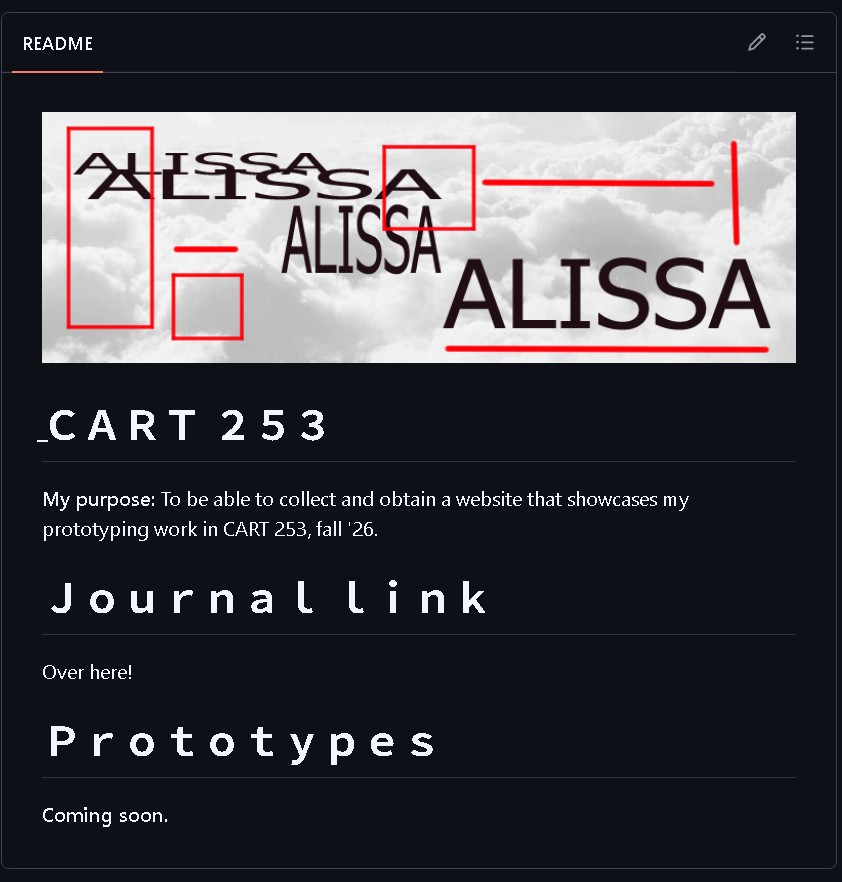

# ＪＯＵＲＮＡＬ

**Ｓｅｐｔｅｍｂｅｒ 17:** I didn't realize it was possible to make a website using Github & Markdown. To be able to showcase future projects that I was going to as well be exploring in future time. Looking at the project almost seemed intimidating. Coding is intimidating to me, it can be frustrated, and confusing. Errors constantly popping up, realizing text can be in the wrong place, moving files and renaming folders for better organization. 

But when I started it, I was completely correct. It was just not clicking to me. Constant looking back at the instructions, searching it up on different websites, asking friends for help, it was all growing tiring. Although with each mistake that comes along, I was getting better. No one can really just stay stale if you're really trying.

So time keeps moving, and everything slowly started to come along. Changing from not understanding what the concept of Markdown even was, to making a website using the language. That's why I was always so interested to code, because of these experiences. Making something out of nothing. Looking back at my code now, it all looks so simple. I hope to look back at this entry with a more experienced level of coding, and to see the growth I will go through, and I hope my future audience sees my website impressed at the prototypes I'll be tackling this semester.

The website at the beginning of the semeseter.
